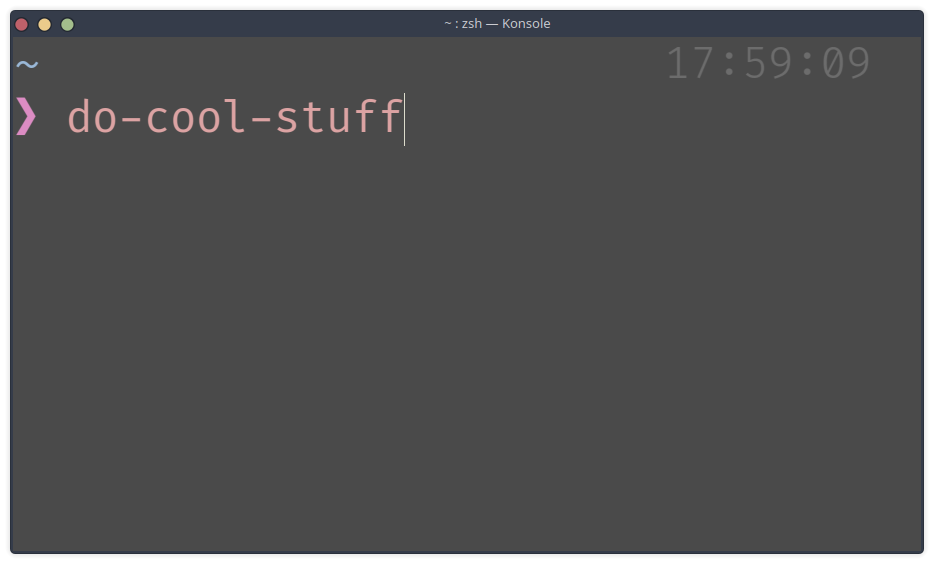
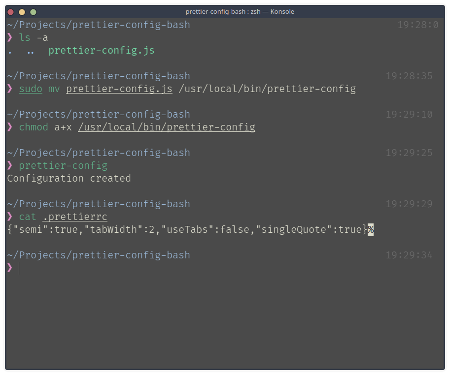

JavaScript is a scripting language, therefore you can write scripts to automate your workflow with JavaScript.



### The background of the snippet

I created a node script recently to automate one workflow that I do repeatedly. Everytime I create a new JavaScript project, I'd create a `.prettierrc` file and add 4 configurations.

The file looks something like this,

```js
{
	"semi": true,
	"singleQuote": true,
	"tabWidth": 2,
	"useTabs": false,
}
```

For those who don't know what this is, it is a configuration file for prettier. You can install it in your code editor to format your source code in a certain way. 

The configuration I created above will make sure that my JS source code will have a semicolon at the end, it will use single quote on strings, it will use 2 spaces for indentation and instead of tabs, the code will use space for indentation.

It is extremely repetitive. I would do this twice or thrice somedays when I am testing some simple snippets. I care about consistent formatting even in simple snippets that I create to test code because I guess I have OCD.

This is why I decided to create this script to save me from this trouble and it was a great learning experience.

## The major pieces

Let's first understand the pieces that create this script and fit it all in together.

### The interpreter
On the top of your scripts, we have to specify the path to the interpreter we plan to use. In our case, it is node. To do so, we have to use <a href='https://en.wikipedia.org/wiki/Shebang_(Unix)' target='_blank'>a shebang line</a>.

For node
```js
#!/usr/bin/env node
```

Some other examples
```sh
- for python
#!/usr/bin/env python3

- for bash
#!/bin/bash
```

### The working directory

For this script to work, it has to know where it is being run at. For example, if I run this script on Projects directory on my home directory (in linux), it should be able to identify that and create a `.prettierrc` file inside `~/Projects`.

For that, we can extract the current working directory from the node's global process object.

```js
process.cwd()
```

This gives us the path to the current working directory.

### The file system module

Node ships a file system module by default. We need to grab the writeFile function from the `fs` module and write our `.prettierrc` file to our file system.

Read the <a href='https://nodejs.org/dist/latest-v14.x/docs/api/fs.html#fs_fs_writefile_file_data_options_callback' target='_blank'>official docs</a>.


**Example**

```js
const fs = require('fs');

/**
  * writeFile(filename, content, callback);
  */

fs.writeFile(
  'test.txt', 
  'This is the content for the file', 
  (error, data) => {
    if (error) {
      console.log(error);
    }

    console.log('File written successfully');
  }
);
```

## Fitting it all together

Now as we have all the background information, we can create the script.

First create a file called `prettier-config` or `prettier-config.js` and paste the following content. 

Note: the extension is not mandatory but remember what you name it because we have to access it later.

```js
#!/usr/bin/env node

const fs = require('fs');

const configs = {
  semi: true,
  tabWidth: 2,
  useTabs: false,
  singleQuote: true,
};

fs.writeFile(
  `${process.cwd()}/.prettierrc`,
  JSON.stringify(configs),
  (error, data) => {
    if (error) {
      console.error('Error creating the configuration file.', error);
    }
    console.log('Configuration created');
  }
);
```

Here, I am just fitting together the information provided above and mixing it to create the .prettierrc file. 

The script stores the configuration file in an object called `configs`. You can add as more configs as you like in this file.

JSON and JS objects might seem similar but they have some minor differences. For example, the keys in a JSON have to be wrapped inside double quotes. That is the reason why I have used `JSON.stringify(configs)` to convert the JS object into a JSON string while writing to the file.

## Executable permission and global access
We generally want our scripts to be available everywhere in our system. Also, we have to give executable permission to our scripts. 

Moving our script to `/usr/local/bin` on our file system will allow us to use the script anywhere on our system. To do so, move the script file,

```bash
mv prettier-config /usr/local/bin/prettier-config

# if you get permission related errors

sudo mv prettier-config /usr/local/bin/prettier-config
```

We want our scripts to have executable (x) permission and we want it to provide this permision to the owner/user, group and others (a).

```bash
sudo chmod a+x /usr/local/bin/prettier-config
```

Now if you try to run `prettier-config` command anywhere on your file system, you will get a .prettierrc file with necessary configuration created.



## Conclusion
If you like my content and want to have a chat then please hit me up on <a href='https://twitter.com/dev_prashaant' target='_blank'>Twitter</a>.