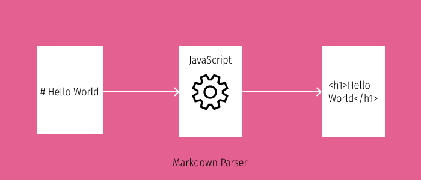

Markdown is a markup language like HTML. It is quite popular among developers to write blogs, readme files, documentation and blogs. Some of the popular websites that support rich text like Reddit, GitHub, Notion etc allow you to write markdown. I use markdown to convert my blog from a markdown file to HTML web pages. Markdown is simple yet very powerful. In this blog, I will be writing about how to build a simple markdown parser to convert md to HTML with JavaScript using Regular Expressions.



## How does a markdown text look like

If you open a markdown file, you'll see the following syntax.

```md
# The text after hash is converted to an h1 in HTML

## Get's converted to h2

**This is a bold text** _italics_
[Link Text](url)
```

Learn more from this [markdown cheatsheet](https://github.com/adam-p/markdown-here/wiki/Markdown-Cheatsheet).

## Regular Expressions

A regular expression is a character sequence that helps us to capture patterns in a text. We can use it to validate user input, find and replace texts and yup, you guessed it, build our markdown parser. 😉

Different languages have different ways to represent RegEx. Here is how it is done in JavaScript.

```js
// Validates all the text that includes the text Hello (case sensitive)
const pattern = /Hello/
const text = 'Hello, beautiful people'
pattern.test(text) // Returns true
```

I will explain the patterns we use in our parser as we reach that section. However, if you want to read more about regular expressions, visit [https://javascript.info](https://javascript.info/regular-expressions).

## Markdown parser

The markdown parser I intend to build is a function that takes markdown text as input and returns HTML.

```js
function parseMarkdown(markdownText) {
	const htmlText = markdownText // do something to this markdown text

	return htmlText
}
```

Here, we want to find a certain pattern in `markdownText` and perform replace operations.

### String replace function

Our markdown parser is simple. It captures a pattern from markdown string passed to the function as `markdownText` argument and replaces it with certain HTML pattern.

Here is how the string replace function works.

```js
text = 'hello world and hello everyone'
regEx = /Hello/gi
console.log(text.replace(regEx, 'hi'))
// prints: 'hi world and hi everyone'
```

> Note: Here the **i flag represents case insensitive** and **g flag represents global**, which means it matches patterns everywhere on the string, not just the first match.

### Capturing groups in Regular Expression

Regular Expressions allows us to capture patterns of text and reference them with something like an index. We can use the index in the replace operation. To represent a group, we can simply wrap it in a parenthesis `()`.

```js
text = 'hello world and hello everyone'
// RegEx to match a string starting with hello followed by anything
regEx = /(Hello).*/i
console.log(text.replace(regEx, 'Matched Group: $1'))
// prints: 'Matched Group: hello'
```

Here, we have stored the starting hello in a group. The group can then be referenced with **\$1** on our replace operation.

### Back to the parser

Now, we want to parse the markdown text and replace it with HTML.

Here are the RegExes we will use in our parser and their explanation.

1. **Heading** <br/>
   For heading, we want a string that starts with a hash(es) and captures everything after those characters.

   ```js
   const h3 = /^### (.*$)/gim
   ```

   > Here the first carat `^` represents line starting with and m flag represents multiple lines and by doing .\* we are capturing everything (letters, numbers, special characters) that exists there.

2. **Blockquote** <br />
   For blockquote, we want a line that starts with `>` and captures everything after that character.

   ```js
   const bq = /^\> (.*$)/gim
   ```

   > Note: \\> represents escaping > character. That means, don't treat > as a part of special regEx character but as a part of that text itself.

3. **Bold Text** <br />
   For bold text, we want to capture a text between 2 asterisks.

   ```js
   const bold = /\*\*(.*)\*\*/gim
   ```

4. **Italics Text** <br />
   For italic text, we want to capture a text between one asterisk.

   ```js
   const italics = /\*(.*)\*/gim
   ```

5. **For image, link and line break** <br />
   ```js
   // 
   const image = /!\[(.*?)\]\((.*?)\)/gim
   // [text](url)
   const link = /\[(.*?)\]\((.*?)\)/gim
   const lineBreak = /\n$/gim
   ```

### Fitting it all together

By this point, you probably have all the background necessary to understand the concepts. Let's fit all the things that we have learnt up to now and build the parser.

```js
function parseMarkdown(markdownText) {
	const htmlText = markdownText
		.replace(/^### (.*$)/gim, '<h3>$1</h3>')
		.replace(/^## (.*$)/gim, '<h2>$1</h2>')
		.replace(/^# (.*$)/gim, '<h1>$1</h1>')
		.replace(/^\> (.*$)/gim, '<blockquote>$1</blockquote>')
		.replace(/\*\*(.*)\*\*/gim, '<b>$1</b>')
		.replace(/\*(.*)\*/gim, '<i>$1</i>')
		.replace(/!\[(.*?)\]\((.*?)\)/gim, "")
		.replace(/\[(.*?)\]\((.*?)\)/gim, "<a href='$2'>$1</a>")
		.replace(/\n$/gim, '<br />')

	return htmlText.trim()
}
```

Time to test the parser.

```js
const text = `
# Hello World
**This is a bold text**
`

console.log(parseMarkdown(text))
```

Should print:

```sh
<h1>Hello World</h1>
<b>This is a bold text</b><br />
```

Our markdown parser is now completed. It doesn't cover everything that markdown supports. Try implementing them and share the solution with me via twitter.
