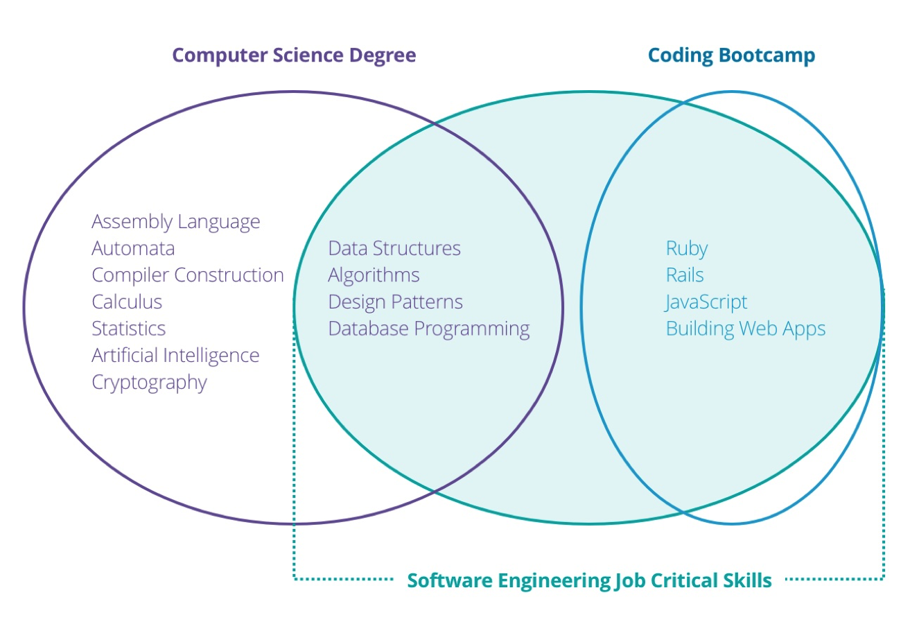

Computer Science is one of the most popular career path for students in this generation. Factors like the scope of it and the pay rate in the field excites many. The case is not different in Nepal and this has few problems. In this blog, I will try to provide my opinion, the problems and not the statistics about Computer Science in the context of Nepal.

I study Computer Science and Information Technology at Sagarmatha College of Science and Technology which is affiliated to Tribhuvan University. At the time of writing, I am in the 4th semester. 

## Computer Science
According to Wikipedia, Computer Science is the study of processes that interact with data and that can be represented as data in the form of programs. It enables the use of algorithms to manipulate, store, and communicate digital information.

Now as we have at least known what Computer Science is, it's really important to solve the misconception about what Computer Science is not. I found a great article by the Boston Univeristy which talks about what is computer science what is it not and many more. You can read the article <a href='https://www.cs.bu.edu/AboutCS/WhatIsCS.pdf' target='_blank'>here</a>. I am going to briefly write it here instead of copying everything. 

>So according to the Boston University, Computer Science is not just about building computers or writing computer programs like astronomy is not about building telescopes, biology about building microscopes or music about building musical instruments. Computer Science is not about the tools we use to solve a Computer Science problems. It is about when to use the tool to solve a particular problem. Computer Science problems don't even require Computers considering the fact that these problems were solved even before computers were built. So, Computer Science is about building computers, writing computer programs and _so much more_....

## Computer Science in Nepal
Nepal is a small country with 10 Universities in the entire country which I didn't even knew before the time of writing. I knew 4 of them and they are Tribhuvan University, Kathmandu University, Pokhara University and Purwanchal University. My unawareness might be because of the quality of them and could also mean that I am not interested in the course they provide like Nepal Sanskrit University which probably teaches the sanskrit language which I am not sure of and it's not the concern right now. Let's move on to discuss about the most popular computer science course in Nepal.

**Tribhuvan University** is the largest university of Nepal. It has affiliated colleges all over the country and hence the number of students enrolled in the univeristy is massive. In terms of no of student enrollment, TU is regarded as one of the top univerisities. I am aware of 4 courses TU provides in the field related to computers. They are Bachelor's of Science in Computer Science and Information Technology (B.Sc CSIT), Bachelor of Engineering in Computer (B.E. Computer), Bachelor of Arts in Computer Application (BCA), and Bachelor in Information Management (BIM). All these subjects deal with similar core subjects related to computers and differ in the additionals they provide like BIM, which deals with Computer and also the use of it in business. The focus of my blog would be about CSIT as it is their core Computer Science subject.

**B.Sc CSIT** is a 4 year (8 Semester) course. There are more than 50 colleges affiliated to the Tribhuvan university that teaches CSIT in Nepal. **CSIT is a research oriented course that focuses more on thoretical computations, design and analysis of algorithms etc and keeps development/engineering of softwares and hardwares secondary.** The subjects covered in this course are the Fundamentals of Computer Programming with C, Object Oriented Programming with C++, Physics, Calculus, Linear algebra, Statistics, Discrete Mathematics, Data Structures and Algorithms, Design and Analysis of Algorithms, Theory of Computations, Compilers, Operating Systems, Databases, Artificial Intelligence, Computer Networking and more. There are a lot of prospects and challenges in this particular course. The syllabus of the course is really good and upto the international standards but there are negetive factors that outweighs the benifits.

## The problems with Computer Science in Nepal
The benefits of Computer Science in Nepal is not the same as it is in other countries. No one is sane here. Students, teachers, university, college and companies contribute in this equally and that frustrates me which can actually be considered as the point of this article to be honest.

### CSIT, A Safe Landing
Go ahead and try to make an estimation about how many students who enroll in CSIT have enrolled in CSIT because they are really passionate about Computers and the Science revolves around it. Do the numbers frighten you? It does to me. Let me explain with context and the result.

Currently, there's a large population of students who choose to study CSIT if they don't get enough scores to qualify for the scolarship in MBBS, Nursing (and similar faculties) or Engineering entrance. I don't want to blame those students because the faculties like MBBS, Agriculture, Nursing etc have unaffordable fee strcuture for a middle class family from Nepal to even think it as a possibility. CSIT has been a place for the safest landing for this group of people because of job security and pay rate. I think Computer Science will never be a great field in Nepal until people stop treating it as a faculty to join when there's no other option left. However, I have also heard stories from people who had never even seen a computer but join computer science for their undergraduate degree and have reached in a successful position. Those people, in their position are not in that situation because of their past. There was a factor that determined their success and it is passion. They were able to bridge the void that existed between the knowledge they had and the knowledge they wanted to acquire. There is a possibility to have a frutful career in Computer Science even as an alternative if you make it your passion after you join it.

>Like Computers, Success in computer science is determined by a binary and some exceptions. You're either passionate about it or you're not and the exception is you might simply get lucky and not everyone is lucky.

Due to this reason, CSIT has been filled with students who are not passionate. How can someone excel in a field in which he doesn't feel passionate about?

### Colleges
The other problem CSIT faces is the colleges that teach CSIT is they teach you the syllabus not the essense of the course. Not all but most of the teachers are too lazy to even get them updated with latest available technologies. Don't you believe me? Ask your C++ teacher the current stable version of C++. You'll get the answer. 😉

I don't mean to disrespect any teachers. I am trying to express the reality. I would also like to thank those teachers who are working really hard to teach computer science as more than syllabus. 

### University and the entire Country
There is simply not enough resource available for computer science in Nepal. Suppose there's a student who wants to do research in the field of IoT in Nepal. Where does he get the support from and is there even a lab where he can continue his work?

This is too much to expect from the university. There is too much carelessness going on in the case of exams. Sometimes the question are out of syllabus. The checking of exam papers is so poor. There has been a case in which someone I know has got more scores than he attempted.

### The Companies
The number of companies in Nepal who are willing to take a batch of interns and be willing to provide them industry level skills can be counted in fingers. There are companies in Nepal who make interns do client projects with no assistance and pay nothing when they are making money out of it. To be able to fit in this kind of market the only thing a student can try to do is teach himself the required skills to fit in the market.

### Situation outside the Kathmandu Valley
In Nepal, everything is centralized inside the Kathmandu valley. The students outside of Kathmandu don't even have proper internet connection and enough lab facilites to complete their experiments specified in the syllabus. 

I interacted with a teacher of mine who worked as the coordinator of a CSIT college outside of the Kathmandu valley and he says the students have to limit themselves with a lot of knowledge and exposure outside the valley. They don't even have teachers in the region to teach them skills outside of the syllabus so for internship they have to come to the capital for **training, not internship** in their final semester.

## The Positives About CS in Nepal
I don't want to discourage anyone by saying all the negatives about the course. There are positive aspects too. I would like to talk about them briefly.

### Positives in CSIT
CSIT course is an affordable course with a lot of prospects. In the past, CSIT was really unmanaged but now it has better management. The course now has been updated to meet the world demands.

### Digital Revolution
Nepal is going through a digital revolution. In the near future, there are going to be a lot of governmental and private jobs in the field of Computer Science in Nepal. There are a lot of possibilites and it's going to grow in the future.

### Unlimited scope outside the country
The best thing about computer science is it is not centralized so you can really fit in anywhere in the world if you have skills. Programming language is same everywhere, data structures are not going to change & the algorithms too.

## Conclusion
A lot of what I said above might be discouraging to people but that is how the reality looks like. I cannot avoid it even if I try to because the nation is moving towards a digital revolution and there is a huge requirement of qualified manpower in the nation and also outside of the nation. Financial stability is a must so choosing computer science for it is not wrong as well. But your passion determines success. Financial security is highly dependent on your willingness to take risk to dedicate time to learn and flourish your skills.