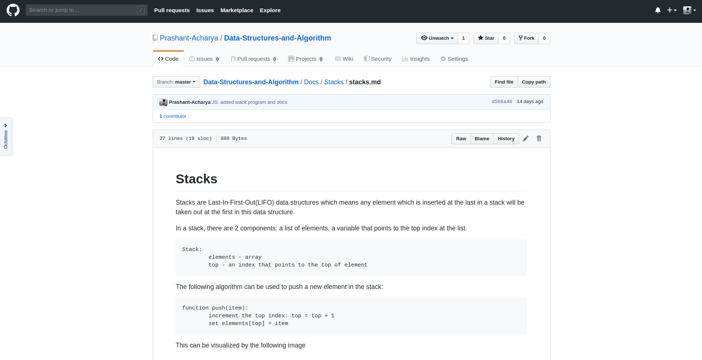

If you see the history of this blog then you can see I have been totally inconsistent about the contents I share on the website. Therefore I am not sure about how to make new promises or commitments about the contents I plan to share ahead. I would still try to make a promise one more time. 😉 Also, I would like to give minor updates on what's happening in my life, the contents of the blog and the contents I am preparing for the future. Let's start with the obvious one first.

### Subscription feature 📧
If you like my content then you have the option to subscribe to my newsletter by scrolling down to the bottom of the page and entering your email. You'll have to check your email and confirm subscription. After that, whenever I add new content, I will notify you through email. That way you'll never have to miss on the contents I share on the website.

### Data Structures Repository
With my friend and a colleague who is an android developer, I have started a repository to upload programs of various data structures. To upload the content I would be referring to various online resources. I have also got a book named Data Structures using C and C++ from my college library by the authors Yedidyah Langsam, Moshe J. Augenstein, Aaron M. Tenenbaum. So I will also refer to the book a lot for the explanation of the contents.

 Though the book is in C and C++, I will be writing the codes in JavaScript and Python and my friend will be writing the codes in Kotlin. I have other works too so I am not sure how frequently I will be contributing to the repository but I will try my best to write proper documentation and proper codes every weekend and update the repository.

<a href='https://github.com/Prashant-Acharya/Data-Structures-and-Algorithm' target='blank'>Link to the repository</a>. Go ahead, check the repository, show some love. Star the repo, fork the repo and please contribute on this open source project. 😉

### Data Structures Course 📚
Warning! No promises. I am thinking about making videos on youtube and other social media platforms for BigOmega.  I want to create a video series on Data Structures.

Now this is a promise, even if I don't do the videos, I will definitely write about Data Structures on the blog. If you don't wanna miss out, go ahead and subscribe. 

## Some personal stuffs 👦
In a personal blog, I guess I am allowed to talk about or share about myself. 😁

### Internship ⚛
I have been doing internship for a few months now and I am working on the front end of a project. I am working with React and exploring a lot more about the react ecosystem so maybe in the future, a lot of content on react will be uploaded on the blog. 

### Expanding BigOmega
My intention has always been expanding BigOmega to not just a blog and to much more. I want to upload pictures and videos on the pages/accounts on various social media that I want to create for BigOmega. I will create accounts on Instagram and YouTube. I have already created a facebook page and a twitter account. I will share the twitter handle and other plans later because there's nothing really for you guys to follow me there because there are no contents.

### Hosting a MLH workshop on Student Developer Day
On October 19th, I will be hosting a workshop on **Building and Deploying Node JS apps with Microsoft Azure**. Interested people can come to Asian College Of Higher Studies at 9:00 AM in the morning to attend the session. There will be 3 other awesome instructors teaching other stuffs. You can attend all 4 workshops if you want to and guess what? The event is totally free and we're also going to provide you a great lunch. 😉

## Conclusion
So that is all for this blog. If you want to stay tuned for the contents that I plan to share in the future as mentioned above then please subscribe to the newsletter by dropping your email below. I am super excited for what's coming next.