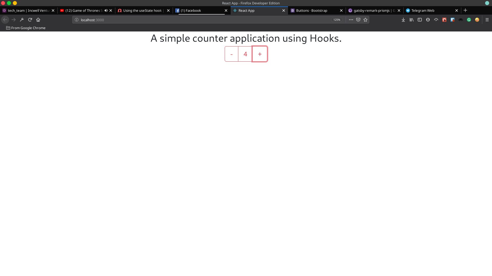

I tried react hooks and it's pretty awesome. With hooks, you can create functional components that can **store state**. It would not have been possible earlier. Hooks are a newer addition in the react library. They are included in the react 16.8 stable release.

In this blog, we will explore hooks briefly by creating a simple counter app. To get started open your terminal and type the following commands & open the project in the code editor of your choice.

```bash
$ npx create-react-app hooks-counter
$ cd hooks-counter
$ npm start
```

Open `app.js` in the `/src` folder, delete everything inside the `<div className='App'></div>` & the logo import.

The code should look like this at this point:
```jsx
import React from 'react'
import './App.css'

function App() {
  return (
    <div className="App">
    </div>
  );
}

export default App
```

Let's also add bootstrap so that we don't have to bother about styling. Go to `public/index.html` and add the following link at the end of the head tag.

```html
<link rel="stylesheet" href="https://stackpath.bootstrapcdn.com/bootstrap/4.3.1/css/bootstrap.min.css">
```

Now let's create a **Counter** component. Inside the `src` directory, create a file named `Counter.js` and copy the following code inside it.

```jsx
import React from 'react'

const Counter = () => {
  const count = 0
  return (
    <div>
      <h2>A simple counter application using Hooks.</h2>
      <div className='btn-group'>
        <button className='btn btn-lg btn-outline-danger'>-</button>
        <button className='btn btn-lg btn-outline-danger'>{count}</button>
        <button className='btn btn-lg btn-outline-danger'>+ </button>
      </div>
    </div>
  )
}

export default Counter
```

We are setting count as 0 by hard coding the value. Now we will explore about how to make it a state and act according.

In order to use the ` useState ` hook, we have to import it from react. To do that we can simply add the import in the first line of the ` Counter.js ` file.

```jsx
import React, { useState } from 'react' // highlight-line

const Counter = () => {
  const count = 0
  return (
    <div>
      <h2>A simple counter application using Hooks.</h2>
      <div className='btn-group'>
        <button className='btn btn-lg btn-outline-danger'>-</button>
        <button className='btn btn-lg btn-outline-danger'>{count}</button>
        <button className='btn btn-lg btn-outline-danger'>+ </button>
      </div>
    </div>
  )
}

export default Counter

```
Now, lets use the `useState` to set the count value to 0.

```jsx
import React, { useState } from 'react'

const Counter = () => {
  // highlight-next-line
  const [count, setCount] = useState(0)
  return (
    <div>
      <h2>A simple counter application using Hooks.</h2>
      <div className='btn-group'>
        <button className='btn btn-lg btn-outline-danger'>-</button>
        <button className='btn btn-lg btn-outline-danger'>{count}</button>
        <button className='btn btn-lg btn-outline-danger'>+ </button>
      </div>
    </div>
  )
}

export default Counter
```

### Let's observe what's happening
Have a look at the following line.
```jsx
const [count, setCount] = useState(0)
```

This is where we are using the first hook, useState. In the code, the **count** is the application state and you can think of the **setCount** as a function that can change the count state, just like `this.setState()` could change the values of the state object. The argument to `useState()` **initializes the count with whatever it is passed with**. In this case, it's 0.

### Adding the event handlers
In order to change the value of the count object, we now have to add event handlers to the + and - buttons. Let's attach increment and decrement functions to with the ability to change the count object.

```jsx
import React, { useState } from 'react'

const Counter = () => {
  const [count, setCount] = useState(0)

  // highlight-start
  const increment = () => {
    setCount(count + 1)
  }

  const decrement = () => {
    setCount(count - 1)
  }
  // highlight-end

  return (
    <div>
      <h2>A simple counter application using Hooks.</h2>
      <div className='btn-group'>
        // highlight-next-line
        <button className='btn btn-lg btn-outline-danger' onClick={decrement}>-</button>
        <button className='btn btn-lg btn-outline-danger'>{count}</button>
        // highlight-next-line
        <button className='btn btn-lg btn-outline-danger' onClick={increment}>+</button>
      </div>
    </div>
  )
}

export default Counter
```

And with that, our counter application is completed. Your output should look like this now


<br>
### Conclusion
Thank you for reading the blog. The source code for the example can be found at this [link](https://github.com/Prashant-Acharya/hooks-counter) and if you want to learn more about react hooks, you could try exploring the official documentation [here](https://reactjs.org/docs/hooks-intro.html). 